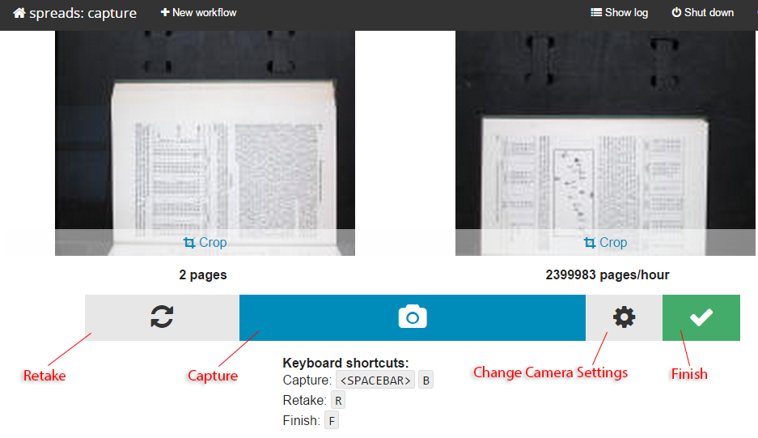

Using The Web Interface
=======================

Connection on a General-Purpose Computer
----------------------------------------
You can connect to the interface by opening your browser on an address that
looks like this::

    http://<host-ip-address>:5000

If you are running spreads in your local machine, using `localhost` or
`127.0.0.1` for the IP address will be enough. If you are running it on a
remote machine, you will have to find out its IP address. When you are
using CHDK cameras and have them turned on when you launch spreads, their
displays will show the IP address of the computer they are connected to.

Connection to SpreadPi
----------------------
By default the web interface to Spreads runs on port 80 so you simply need to point
your browser to the ip address of the Raspberry Pi running SpreadPi::

	http://<raspberry-pi-ip-address>

.. hint::
 
  By default SpreadPi uses the nodename "spreadpi" on the network.  If you
  review the list of connected devices on your router it should be easy to 
  find the ip-address of spreadpi, even when DHCP moves the assignment to 
  different addresses.  
	
Web Workflow Creation
---------------------

The :ref:`initial screen<web-figure1>` will list all previously created workflows with a small
preview image and some information on their status. By clicking one of the
workflows, you will be taken to its details page where you can view all
of the images and see more information on it. You can also choose to download
a ZIP file with the workflow, containing all images and a configuration file.

.. _web-figure1:

*Figure 1: Workflow List*

From the navigation bar, you can choose to **create a new workflow**. The only
setting you absolutely have to enter is the workflow name. You can also change
driver and plugin settings for this workflow by selecting either one from the
dropdown menu. When you are done, you can submit the workflow and the
application will take you to the capture screen.

.. figure:: _static/web_create.png

.. _web_figure2:

*Figure 2: Workflow Creation*

On the **capture screen**, you can see two small review images with which
you can verify that the last capture went well. Trigger a new capture by
clicking the appropriate button and you will see the images update.
If you spotted an error, you can click the *Rektake* button, which will discard
the last capture and trigger a new one. Once you are done, use the *finish*
button.

.. _web_figure3:

*Figure 3: Capture Screen*

.. include:: fields.dat

Web Camera Configuration
------------------------
Arguably the most important part of the workflow creation web page is the lower half
which contains the fields that control the cameras.  This information can also
be reset during the capture process by pressing the button with the gear icon.  

.. _web-figure4:

Figure 4: Camera Configuration

In :ref:`Figure 4<web-figure4>` you see these configuration fields 
with the advanced options fields showing.
The basic camera options are always shown, but the advanced options are hidden until
the check-box labeled *Show advanced options* is checked. The camera configuration 
fields are described below in roughly their order of 
importance/frequency-of-use(not the order in which they appear):

**Default zoom level**
   |zoom-level|
  
**White balance mode**
   This is a pull-down which should be set according to the lights illuminating the
   object being scanned.  For a scanner the most common setting is Tungsten.  Failure
   to set this properly will result in a scan with poor color balance.
   
**ISO Sensitivity**
   |iso|
   
**Capturing Resolution**
   |dpi|
   
**Set Focus Distance**
   |focus-distance|
   
**Shutter speed**
   |shutter-speed|
 
**Shoot in Monochrome** (checkbox)
   Self explanatory

**Cameras upside-down** (checkbox)
   Automatically rotate images 180 degrees

**Switch Target Pages** (checkbox)  
   Switch the even/odd camera settings

**Shoot Raw** (checkbox)
   |shoot-raw|

.. hint::
  Most of the camera configuration data is sent directly to the CHDK firmware
  on the camera(s), therefore you may need to refer to the 
  `CHDK wiki <http://chdk.wikia.com/wiki/CHDK>`_
  to determine the appropriate settings for your camera.  Incorrect values can
  hang the cameras and/or spreads requiring a restart.

